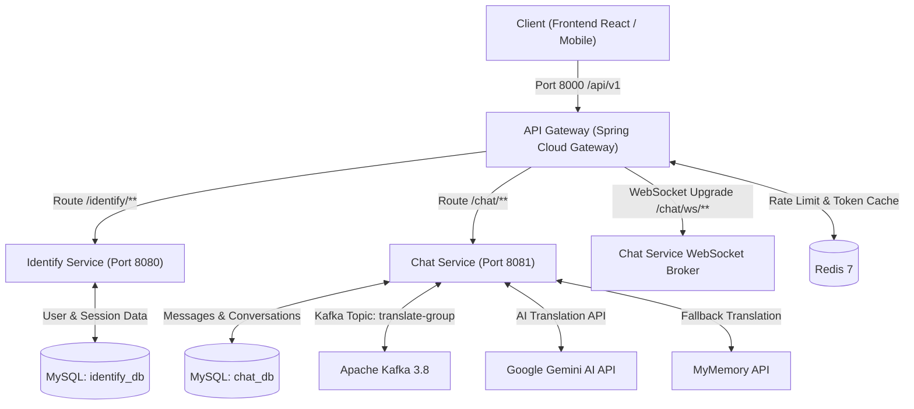

# 🏛️ 01 - Backend Project Foundation & Architecture

> Tài liệu tổng quan về nền tảng kỹ thuật, kiến trúc phân tầng Microservices, quản lý cấu hình và hạ tầng của **Multilingual Web Chat Backend**.

---

## 📑 MỤC LỤC
1. [Tổng Quan Kiến Trúc Microservices](#1-tổng-quan-kiến-trúc-microservices)
2. [Tech Stack & Runtime Environment](#2-tech-stack--runtime-environment)
3. [Cấu Trúc Thư Mục & Phân Hệ Microservices](#3-cấu-trúc-thư-mục--phân-hệ-microservices)
4. [Quản Lý Thư Viện & Dependencies (pom.xml)](#4-quản-lý-thư-viện--dependencies-pomxml)
5. [Cấu Hình Ứng Dụng (Application Configuration)](#5-cấu-hình-ứng-dụng-application-configuration)
6. [Hạ Tầng Docker & Điều Phối Dịch Vụ (Orchestration)](#6-hạ-tầng-docker--điều-phối-dịch-vụ-orchestration)

---

## 1. Tổng Quan Kiến Trúc Microservices

Hệ thống Backend của **Multilingual Web Chat** được thiết kế theo kiến trúc **Microservices hướng sự kiện (Event-Driven Architecture)**, phân tách rõ ràng trách nhiệm giữa các dịch vụ:

- **API Gateway (`api-gateway` - Port 8000)**: Cổng vào duy nhất (Single Entry Point) cho mọi HTTP/REST request và WebSocket STOMP handshake. Chịu trách nhiệm Reverse Proxy, xác thực sơ bộ qua Token Introspection, giới hạn tần suất gọi API (Rate Limiting) và bảo vệ an ninh qua HTTP Security Headers.
- **Identify Service (`identify-service` - Port 8080)**: Chịu trách nhiệm quản lý định danh người dùng (User Management), xác thực JWT (Authentication), tích hợp Google OAuth2, kích hoạt tài khoản qua Email (Brevo/SMTP), quản lý phiên đăng nhập (User Sessions) và bảng điều khiển quản trị (Admin Dashboard).
- **Chat Service (`chat-service` - Port 8081)**: Trái tim của ứng dụng trò chuyện thời gian thực, quản lý hội thoại 1-1, nhóm chat, kênh (channel), thành viên nhóm, lịch sử tin nhắn và bình chọn. Tích hợp STOMP WebSocket Broker, WebRTC Signaling cho cuộc gọi P2P và Kafka Producer/Consumer kết nối Google Gemini AI để dịch thuật tin nhắn tự động.



---

## 2. Tech Stack & Runtime Environment

| Thành Phần | Công Nghệ / Thư Viện | Phiên Bản | Mục Đích Sử Dụng |
| :--- | :--- | :--- | :--- |
| **Ngôn ngữ** | **Java 21 (LTS)** | OpenJDK 21 | Hiệu năng cao, Virtual Threads, Pattern Matching |
| **Framework lõi** | **Spring Boot** | **3.4.7 / 3.4.8** | Nền tảng Spring hiện đại nhất, WebMvc & WebFlux |
| **Hệ thống Cloud** | **Spring Cloud** | **2024.0.1** | Spring Cloud Gateway Reactive, Spring Cloud OpenFeign |
| **Bảo mật & Token** | **Spring Security + Nimbus JOSE** | 3.4.x | JWT Token signer (HMAC-SHA512), OAuth2 Resource Server |
| **OAuth2 Client** | **Spring OAuth2 Client** | 3.4.x | Đăng nhập một chạm bằng tài khoản Google |
| **ORM / Data** | **Spring Data JPA / Hibernate 6** | 3.4.x | Ánh xạ đối tượng quan hệ, Transaction Management |
| **Cơ sở dữ liệu** | **MySQL 8.0+** | 8.0.x | Lưu trữ quan hệ đa CSDL (`identify_db`, `chat_db`), utf8mb4 |
| **Bộ nhớ đệm / Cache**| **Redis (Reactive & Classic)** | **7.x** | Rate Limiting (Token Bucket), Blacklist Tokens, Session Store |
| **Message Broker** | **Apache Kafka** | **3.8.0** | Hàng đợi sự kiện dịch thuật bất đồng bộ (`translate-group`) |
| **Realtime Messaging**| **Spring WebSocket (STOMP)** | 3.4.8 | STOMP message broker, WebRTC signaling cho video call |
| **Trí tuệ nhân tạo** | **Google Gemini AI (REST)** | v1beta | Dịch tự động tin nhắn đa ngôn ngữ theo ngữ cảnh |
| **Dịch thuật dự phòng**| **MyMemory API** | REST HTTP | Dịch dự phòng tự động khi Gemini vượt hạn mức |
| **Email Service** | **Brevo API / SMTP Mail** | 1.1.0 | Gửi email kích hoạt tài khoản và đặt lại mật khẩu |
| **Object Mapping** | **MapStruct** | **1.6.2** | Chuyển đổi siêu tốc giữa Entity và DTO (Compile-time) |
| **Boilerplate** | **Project Lombok** | **1.18.x** | Tự động sinh Builder, Getter, Setter, Constructors |
| **Tài liệu API** | **SpringDoc OpenAPI (Swagger UI)**| **2.8.9** | Giao diện tương tác và kiểm thử API trực quan |

---

## 3. Cấu Trúc Thư Mục & Phân Hệ Microservices

```
backend/
├── api-gateway/                             # Spring Cloud Gateway Service
│   ├── pom.xml
│   └── src/main/
│       ├── java/com/example/gateway/
│       │   ├── GatewayApplication.java      # Main entry point
│       │   ├── config/                      # AuthenticationFilter, CorsDeduplicationFilter, WebClientConfig
│       │   ├── dto/response/                # ApiResponse, IntrospectResponse
│       │   └── service/                     # IdentifyService (WebClient gọi sang identity-service)
│       └── resources/
│           └── application.yaml             # Cấu hình định tuyến Route, WebSocket upgrade, Redis
│
├── identity-service/                        # Identity, User & Session Management Service
│   ├── pom.xml
│   └── src/main/
│       ├── java/com/example/identity/
│       │   ├── IdentityServiceApplication.java
│       │   ├── controller/                  # AuthenticationController, UserController, AdminController
│       │   ├── dto/                         # Request & Response payloads
│       │   ├── entity/                      # User, UserSession, Report, AuditLog, SystemConfig, InvalidatedToken
│       │   ├── repository/                  # Spring Data JPA Repositories
│       │   ├── service/                     # AuthenticationService, UserService
│       │   ├── mapper/                      # MapStruct Mappers
│       │   ├── exception/                   # GlobalExceptionHandler, AppException, ErrorCode
│       │   └── config/                      # SecurityConfig, JwtAuthenticationEntryPoint
│       └── resources/
│           └── application.yaml             # Cấu hình DataSource identify_db, Google OAuth2, Mail
│
├── chat-service/                            # Real-time Messaging, Groups & WebRTC Service
│   ├── pom.xml
│   └── src/main/
│       ├── java/com/example/chat/
│       │   ├── ChatServiceApplication.java
│       │   ├── client/                      # OpenFeign Clients (IdentifyClient, TranslateClient)
│       │   ├── controller/                  # ChatController (STOMP & Kafka), ConversationController, MessageController
│       │   ├── dto/                         # MessageRequest, ConversationRequest, responses
│       │   ├── entity/                      # Conversation, GroupMember, GroupMemberId, Message
│       │   ├── repository/                  # ConversationRepository, GroupMemberRepository, MessageRepository
│       │   ├── service/                     # ChatService, ConversationService, MessageService
│       │   ├── config/                      # WebSocketConfig, KafkaConfig, SecurityConfig
│       │   ├── constant/                    # MessageType (TEXT, IMAGE, CALL_SIGNAL, POLL...)
│       │   └── exception/                   # GlobalExceptionHandler, ErrorCode
│       └── resources/
│           └── application.yaml             # Cấu hình chat_db, Kafka Consumer/Producer, STOMP endpoints
│
├── docker-compose.yml                       # Khởi chạy Redis 7, Kafka 3.8 và 3 services
├── k8s-manifests.yaml                       # Triển khai Kubernetes
└── MultilingualWebChat.sql                  # Khởi tạo CSDL MySQL (identify_db, chat_db)
```

---

## 4. Quản Lý Thư Viện & Dependencies (pom.xml)

Mỗi service quản lý `pom.xml` riêng biệt kế thừa `spring-boot-starter-parent` phiên bản `3.4.7` hoặc `3.4.8`:

1. **`api-gateway/pom.xml`**:
   - `spring-cloud-starter-gateway`: Định tuyến non-blocking dựa trên Reactor Netty.
   - `spring-boot-starter-data-redis-reactive`: Đếm request và kiểm soát Rate Limit.
   - `spring-session-data-redis`: Lưu trữ trạng thái Gateway Session nếu cần.
2. **`identify-service/pom.xml`**:
   - `spring-boot-starter-data-jpa` & `mysql-connector-j`: Truy cập CSDL `identify_db`.
   - `spring-boot-starter-oauth2-resource-server` & `spring-boot-starter-oauth2-client`: Bảo mật JWT và đăng nhập Google OAuth2.
   - `brevo` (`1.1.0`): Gửi Transactional Email kích hoạt tài khoản.
   - `spring-boot-starter-data-redis`: Lưu trữ token blacklist và session.
3. **`chat-service/pom.xml`**:
   - `spring-boot-starter-websocket`: Hỗ trợ STOMP protocol qua SubProtocolWebSocketHandler.
   - `spring-kafka`: Tích hợp Apache Kafka Producer & Consumer (`@KafkaListener`).
   - `spring-cloud-starter-openfeign`: Gọi REST đồng bộ sang `identify-service` và Google Gemini API.

---

## 5. Cấu Hình Ứng Dụng (Application Configuration)

### 5.1 Cấu Hình API Gateway (`api-gateway/src/main/resources/application.yaml`)
- **Port:** `8000`
- **Prefix:** `/api/v1`
- **Các Route Cốt Lõi:**
  1. `chat-ws`: `ws://chat-service:8081` (Path: `/api/v1/chat/ws/**`, Header: `Upgrade, websocket`)
  2. `oauth2-initiate` & `oauth2-success`: Điều hướng phiên Google OAuth2 đến `identify-service:8080`.
  3. `identify-service`: Chuyển tiếp `/api/v1/identify/**` -> `http://identify-service:8080`.
  4. `chat-service`: Chuyển tiếp `/api/v1/chat/**` -> `http://chat-service:8081`.

### 5.2 Cấu Hình Identify Service (`identify-service/src/main/resources/application.yaml`)
- **Port:** `8080`
- **Context-path:** `/identify`
- **Database:** `jdbc:mysql://localhost:3306/identify_db?createDatabaseIfNotExist=true`
- **Security:** `app.jwt.signerKey` (khóa ký HMAC-SHA512 tối thiểu 64 ký tự).

### 5.3 Cấu Hình Chat Service (`chat-service/src/main/resources/application.yaml`)
- **Port:** `8081`
- **Context-path:** `/chat`
- **Database:** `jdbc:mysql://localhost:3306/chat_db?createDatabaseIfNotExist=true`
- **Kafka:** `spring.kafka.bootstrap-servers: localhost:9092`, GroupId: `translate-group`.

---

## 6. Hạ Tầng Docker & Điều Phối Dịch Vụ (Orchestration)

File `docker-compose.yml` định nghĩa toàn bộ hạ tầng cục bộ:

```yaml
services:
  redis:
    image: redis:7
    container_name: redis
    command: redis-server --requirepass ${REDIS_PASSWORD:-changeme_in_production}
    ports: ["6379:6379"]

  kafka:
    image: apache/kafka:3.8.0
    container_name: kafka
    environment:
      - KAFKA_NODE_ID=0
      - KAFKA_PROCESS_ROLES=broker,controller
      - KAFKA_LISTENERS=PLAINTEXT://:9092,CONTROLLER://:9093,EXTERNAL://:9094
      - KAFKA_ADVERTISED_LISTENERS=PLAINTEXT://kafka:9092,EXTERNAL://localhost:9094
      - KAFKA_CONTROLLER_QUORUM_VOTERS=0@kafka:9093
      - KAFKA_AUTO_CREATE_TOPICS_ENABLE=true

  identify-service:
    build: ./identify-service
    ports: ["8080:8080"]
    depends_on: [redis]

  chat-service:
    build: ./chat-service
    ports: ["8081:8081"]
    depends_on: [kafka, redis]

  api-gateway:
    build: ./api-gateway
    ports: ["8000:8000"]
    depends_on: [identify-service, chat-service]
```
