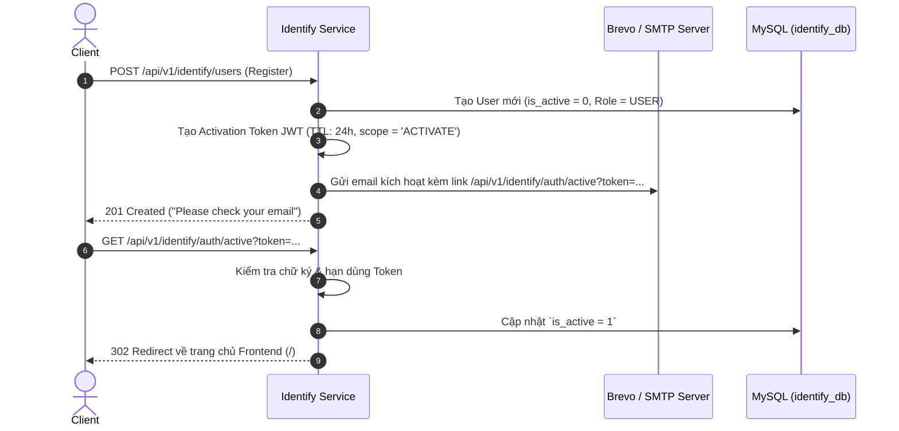

# 🔒 02 - Authentication, Security & Authorization Flow

> Tài liệu phân tích chuyên sâu kiến trúc an ninh, xác thực JWT, cơ chế phòng thủ Brute-force & Rate Limiting, xác thực một chạm Google OAuth2, thu hồi Token và phân quyền RBAC trong **Multilingual Web Chat Backend**.

---

## 📑 MỤC LỤC
1. [Kiến Trúc Chuỗi Lọc An Ninh (Security Filter Chain)](#1-kiến-trúc-chuỗi-lọc-an-ninh-security-filter-chain)
2. [Cơ Chế Xác Thực JWT & Ký Số (Nimbus JOSE)](#2-cơ-chế-xác-thực-jwt--ký-số-nimbus-jose)
3. [Luồng Đăng Nhập Mật Khẩu & Google OAuth2](#3-luồng-đăng-nhập-mật-khẩu--google-oauth2)
4. [Kích Hoạt Tài Khoản Email & Đặt Lại Mật Khẩu](#4-kích-hoạt-tài-khoản-email--đặt-lại-mật-khẩu)
5. [Cơ Chế Thu Hồi Token & Quản Lý Đa Phiên Đăng Nhập (User Sessions)](#5-cơ-chế-thu-hồi-token--quản-lý-đa-phiên-đăng-nhập-user-sessions)
6. [Hệ Thống Phân Tầng Giới Hạn Tần Suất (Redis Rate Limiting)](#6-hệ-thống-phân-tầng-giới-hạn-tần-suất-redis-rate-limiting)
7. [Phân Quyền Vai Trò (RBAC) & Ngăn Chặn Lỗ Hổng IDOR](#7-phân-quyền-vai-trò-rbac--ngăn-chặn-lỗ-hổng-idor)

---

## 1. Kiến Trúc Chuỗi Lọc An Ninh (Security Filter Chain)

Mọi HTTP request từ Client khi gửi đến hệ thống đều phải đi qua 2 tầng bảo vệ:

```
[ Client Request ] 
       │
       ▼
┌─────────────────────────────────────────────────────────────┐
│ 1. API GATEWAY (Port 8000)                                  │
│  ├─ CorsDeduplicationFilter (Loại bỏ trùng lặp header CORS) │
│  ├─ Security Headers Injection (CSP, HSTS, X-Frame-Options)  │
│  ├─ Reactive Redis RateLimitingFilter (5 req/m hoặc 10/m)   │
│  └─ AuthenticationFilter:                                   │
│       - Bỏ qua Public Endpoints (/auth, /swagger-ui, v.v.)  │
│       - Bóc tách Bearer Token và gọi identifyService        │
└──────────────────────────────┬──────────────────────────────┘
                               │ (Forward request kèm User context)
                               ▼
┌─────────────────────────────────────────────────────────────┐
│ 2. MICROSERVICE TẦNG DƯỚI (Identify Service / Chat Service) │
│  ├─ JwtAuthenticationEntryPoint (Bắt lỗi 401 Unauthorized)  │
│  ├─ NimbusJwtDecoder (Giải mã chữ ký HMAC-SHA512)           │
│  └─ JwtAuthenticationConverter (Chuyển SCOPE_ROLE -> Auth)  │
└─────────────────────────────────────────────────────────────┘
```

---

## 2. Cơ Chế Xác Thực JWT & Ký Số (Nimbus JOSE)

Hệ thống sử dụng thư viện **Nimbus JOSE + JWT** để sinh và kiểm chứng chữ ký:
- **Thuật toán ký:** `HS512` (HMAC sử dụng SHA-512) với khóa bí mật tối thiểu 64 bytes (`app.jwt.signerKey`).
- **Thời gian sống của Access Token:** 1 giờ (hoặc tùy chỉnh qua cấu hình).
- **Cấu trúc Claim trong Token:**
  - `sub`: User ID của người dùng (ví dụ: `usr_9b1deb4d`).
  - `iss`: Issuer định danh hệ thống (`webchat.com`).
  - `iat`: Thời điểm phát hành token (Timestamp Epoch).
  - `exp`: Thời điểm token hết hạn.
  - `jti`: Token ID ngẫu nhiên (UUIDv4) để phục vụ việc blacklist token.
  - `scope`: Vai trò người dùng (`ROLE_USER` hoặc `ROLE_ADMIN`).

---

## 3. Luồng Đăng Nhập Mật Khẩu & Google OAuth2

### 3.1 Luồng Đăng Nhập Truyền Thống (Username / Password)
1. Client gửi `POST /api/v1/identify/auth` với `username` và `password`.
2. `Identify Service` tìm kiếm user trong CSDL `identify_db`.
3. Kiểm tra mật khẩu bằng `PasswordEncoder.matches(rawPassword, user.getPassword())` (BCrypt hash).
4. Kiểm tra cờ `is_active`: Nếu `false`, trả về `ErrorCode.NOT_ACTIVATE_YET` (1006).
5. Nếu hợp lệ:
   - Sinh Access Token mới.
   - Ghi lại bản ghi phiên đăng nhập vào bảng `user_sessions` (lưu IP, User-Agent, thời điểm hết hạn).
   - Thiết lập HttpOnly Cookie `token` vào Response Header và trả JSON `AuthenticationResponse`.

### 3.2 Luồng Đăng Nhập Một Chạm Google OAuth2
1. Người dùng bấm "Đăng nhập với Google" -> Trình duyệt chuyển hướng đến Gateway: `/api/v1/identify/login/oauth2/authorization/google`.
2. Gateway forward đến `identify-service`, mở trang đăng nhập ủy quyền của Google.
3. Google phản hồi mã authorization code về callback `/api/v1/identify/auth/oauth2/success`.
4. `AuthenticationController.oauth2Success()` bóc tách thông tin từ Google Principal:
   - `email`, `fullName`, `avatar`, `google_id` (claim `sub`).
5. `AuthenticationService.authenticateOAuth2()`:
   - Nếu email đã tồn tại: Cập nhật `google_id` và avatar.
   - Nếu chưa tồn tại: Tự động tạo User mới với vai trò `ROLE_USER`, trạng thái `is_active = true`.
6. Hệ thống tạo JWT Token và thực hiện chuyển hướng trình duyệt về Frontend:
   `Redirect: ${app.frontend.url}/chat?token=<JWT_TOKEN>`.

---

## 4. Kích Hoạt Tài Khoản Email & Đặt Lại Mật Khẩu

### 4.1 Kích Hoạt Tài Khoản Sau Khi Đăng Ký


### 4.2 Luồng Quên & Đặt Lại Mật Khẩu
1. **Yêu cầu:** Client gửi `POST /api/v1/identify/auth/forgot-password` kèm email.
2. **Xử lý:** Hệ thống tạo một Token tạm thời có thời hạn 15 phút với mục đích `RESET_PASSWORD` và gửi link đặt lại qua email.
3. **Thực hiện:** Người dùng nhấn link và gửi `POST /api/v1/identify/auth/reset-password` kèm token và mật khẩu mới.
4. **Cập nhật:** Hệ thống kiểm tra token, băm BCrypt mật khẩu mới và lưu vào bảng `users`.

---

## 5. Cơ Chế Thu Hồi Token & Quản Lý Đa Phiên Đăng Nhập (User Sessions)

### 5.1 Thu Hồi Token (Logout / Token Blacklist)
- Khi người dùng gửi yêu cầu `POST /api/v1/identify/auth/logout`:
  - Token JWT được phân tích để lấy `jti` (Token ID) và thời gian hết hạn `exp`.
  - Hệ thống lưu bản ghi vào bảng `invalidated_token` trong MySQL và đồng thời ghi vào Redis với TTL tương ứng với thời gian sống còn lại của token.
  - Khi token này được sử dụng lại, Gateway hoặc Identify Service sẽ kiểm tra trong danh sách đen và lập tức từ chối với mã lỗi `401 Unauthorized`.

### 5.2 Quản Lý Đa Phiên Đăng Nhập (Active User Sessions)
Mỗi lần đăng nhập thành công sinh ra một bản ghi trong bảng `user_sessions`:
- `session_id`: UUID duy nhất của phiên.
- `user_id`: Người dùng sở hữu.
- `ip_address`: Địa chỉ IP đăng nhập (hỗ trợ đọc từ `X-Forwarded-For`).
- `user_agent`: Thông tin trình duyệt/hệ điều hành.
- `expires_at`: Thời điểm hết hạn phiên.
- `is_revoked`: Trạng thái đã bị hủy bỏ từ xa.

**APIs Hỗ Trợ:**
- `GET /api/v1/identify/auth/sessions`: Người dùng xem tất cả thiết bị/phiên đang đăng nhập.
- `DELETE /api/v1/identify/auth/sessions/{sessionId}`: Hủy bỏ phiên từ xa (Force logout thiết bị khác).

---

## 6. Hệ Thống Phân Tầng Giới Hạn Tần Suất (Redis Rate Limiting)

Tại tầng **API Gateway**, `AuthenticationFilter` tích hợp với `ReactiveStringRedisTemplate` áp dụng cơ chế giới hạn tần suất dựa trên IP thực của client:

1. **Nhóm Endpoint Nhạy Cảm (Strict Endpoints):**
   - Áp dụng cho: `/auth`, `/auth/forgot-password`, `/auth/refresh`.
   - **Hạn mức:** Tối đa **5 request / phút / IP**.
   - Mục đích: Ngăn chặn triệt để tấn công vét cạn mật khẩu (Brute-force) và lạm dụng API gửi mail.
2. **Nhóm Endpoint Thông Thường (Standard Rate Limit):**
   - Áp dụng cho toàn bộ các API công khai khác.
   - **Hạn mức:** Tối đa **10 request / phút / IP**.
3. **Phản Hồi Khi Vượt Ngưỡng:**
   - Trả về mã lỗi HTTP `429 Too Many Requests`.

---

## 7. Phân Quyền Vai Trò (RBAC) & Ngăn Chặn Lỗ Hổng IDOR

### 7.1 Phân Quyền Vai Trò Toàn Cục
Hệ thống sử dụng cơ chế `@PreAuthorize` của Spring Security:
```java
// Chỉ dành riêng cho Quản trị viên hệ thống
@PreAuthorize("hasAuthority('SCOPE_ROLE_ADMIN')")
@PutMapping("/admin/users/{userId}/toggle-ban")
public ResponseEntity<ApiResponse<Boolean>> toggleBanUser(@PathVariable String userId) { ... }
```

### 7.2 Ngăn Chặn Lỗ Hổng IDOR (Insecure Direct Object References)
- Khi người dùng thực hiện sửa/xóa tin nhắn (`/api/v1/chat/message/{messageId}` hoặc qua STOMP `/app/chat`), Chat Service bắt buộc phải đối chiếu:
  ```java
  if (!message.getUserId().equals(principal.getName())) {
      throw new AppException(ErrorCode.UNAUTHORIZED);
  }
  ```
- Khi truy cập hoặc gửi tin vào hội thoại: Bắt buộc kiểm tra quan hệ thành viên trong bảng `group_member`. Nếu chưa tham gia hoặc cờ `is_banned = true`, hệ thống lập tức từ chối quyền truy cập.
