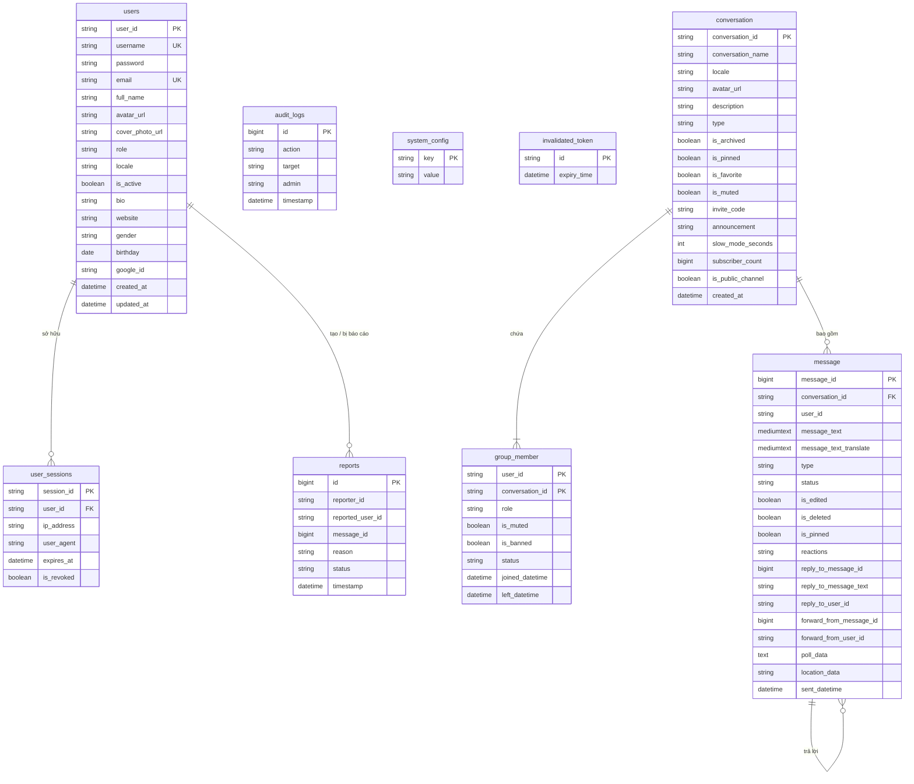

# 🗄️ Multilingual Web Chat Database Schema & Data Models

> Tài liệu mô tả chi tiết kiến trúc đa cơ sở dữ liệu (Multi-Database Architecture), lược đồ bảng MySQL (`identify_db`, `chat_db`), kiểu dữ liệu, ràng buộc toàn vẹn và thực thể JPA trong nền tảng **Multilingual Web Chat**.

---

## 📑 MỤC LỤC
1. [Tổng Quan Kiến Trúc Đa CSDL (Multi-Database Architecture)](#1-tổng-quan-kiến-trúc-đa-csdl-multi-database-architecture)
2. [Sơ Đồ Thực Thể Mối Quan Hệ (Mermaid ERD)](#2-sơ-đồ-thực-thể-mối-quan-hệ-mermaid-erd)
3. [Chi Tiết Bảng Dữ Liệu `identify_db`](#3-chi-tiết-bảng-dữ-liệu-identify_db)
4. [Chi Tiết Bảng Dữ Liệu `chat_db`](#4-chi-tiết-bảng-dữ-liệu-chat_db)
5. [Cấu Trúc Lưu Trữ Bộ Nhớ Đệm Redis (In-Memory Cache)](#5-cấu-trúc-lưu-trữ-bộ-nhớ-đệm-redis-in-memory-cache)

---

## 1. Tổng Quan Kiến Trúc Đa CSDL (Multi-Database Architecture)

Hệ thống phân chia CSDL theo nguyên tắc cách ly dữ liệu Microservices (Database per Service pattern) sử dụng **MySQL 8.0+** kết hợp **Redis 7**:

1. **`identify_db` (MySQL)**: Quản lý định danh người dùng, mật khẩu đã mã hóa, trạng thái kích hoạt, hồ sơ cá nhân, các phiên đăng nhập đang hoạt động, nhật ký kiểm vết an ninh, báo cáo vi phạm và token bị thu hồi.
2. **`chat_db` (MySQL)**: Quản lý các phòng chat cá nhân (1-1), nhóm chat, kênh thông báo (Channel), quan hệ thành viên trong nhóm kèm phân quyền, các thiết lập cá nhân (ghim, tắt tiếng, lưu trữ) và toàn bộ lịch sử tin nhắn đa phương tiện.
3. **Redis Store**: Quản lý Rate Limiting dựa trên địa chỉ IP, lưu trữ danh sách đen Token (Blacklist Tokens) và kiểm tra trạng thái hoạt động tức thời.

---

## 2. Sơ Đồ Thực Thể Mối Quan Hệ (Mermaid ERD)

---

## 3. Chi Tiết Bảng Dữ Liệu `identify_db`

### 3.1 Bảng `users` (Quản Lý Tài Khoản Người Dùng)
| Tên Cột | Kiểu Dữ Liệu | Ràng Buộc | Mô Tả |
| :--- | :--- | :--- | :--- |
| `user_id` | `VARCHAR(50)` | `PRIMARY KEY` | Mã định danh người dùng (VD: `usr_9b1deb4d` hoặc `admin`) |
| `username` | `VARCHAR(50)` | `NOT NULL, UNIQUE` | Tên đăng nhập duy nhất |
| `password` | `VARCHAR(255)` | `NOT NULL` | Mật khẩu băm BCrypt (`$2a$10$...`) |
| `email` | `VARCHAR(100)` | `NOT NULL, UNIQUE` | Địa chỉ email người dùng |
| `full_name`| `VARCHAR(100)` | `NOT NULL` | Họ và tên đầy đủ |
| `avatar_url` | `VARCHAR(500)` | `NULL` | Đường dẫn ảnh đại diện trên Cloudinary |
| `cover_photo_url`| `VARCHAR(500)`| `NULL`| Đường dẫn ảnh bìa |
| `role` | `VARCHAR(20)` | `NOT NULL, DEFAULT 'ROLE_USER'` | Vai trò: `ROLE_USER` hoặc `ROLE_ADMIN` |
| `locale` | `VARCHAR(10)` | `NOT NULL, DEFAULT 'VI'` | Ngôn ngữ ưu tiên (`VI`, `EN`, `JA`, `KO`, `ZH`) |
| `is_active`| `BOOLEAN` | `NOT NULL, DEFAULT 0` | Trạng thái kích hoạt (0: Chưa kích hoạt/Khóa, 1: Hoạt động) |
| `bio` | `TEXT` | `NULL` | Tiểu sử bản thân |
| `website` | `VARCHAR(255)` | `NULL` | Trang web cá nhân |
| `gender` | `VARCHAR(10)` | `NULL` | Giới tính: `MALE`, `FEMALE`, `OTHER` |
| `birthday` | `DATE` | `NULL` | Ngày sinh |
| `google_id`| `VARCHAR(100)` | `NULL` | ID định danh từ Google OAuth2 |
| `created_at`| `DATETIME(6)` | `DEFAULT CURRENT_TIMESTAMP` | Thời điểm tạo |
| `updated_at`| `DATETIME(6)` | `DEFAULT CURRENT_TIMESTAMP` | Thời điểm cập nhật cuối |

### 3.2 Bảng `user_sessions` (Quản Lý Phiên Làm Việc)
| Tên Cột | Kiểu Dữ Liệu | Ràng Buộc | Mô Tả |
| :--- | :--- | :--- | :--- |
| `session_id` | `VARCHAR(50)` | `PRIMARY KEY` | Mã phiên đăng nhập UUID |
| `user_id` | `VARCHAR(50)` | `NOT NULL` | Mã người dùng sở hữu |
| `ip_address` | `VARCHAR(50)` | `NULL` | Địa chỉ IP của thiết bị |
| `user_agent` | `TEXT` | `NULL` | Chuỗi User-Agent trình duyệt |
| `expires_at` | `DATETIME(6)` | `NOT NULL` | Thời điểm phiên hết hạn |
| `is_revoked` | `BOOLEAN` | `DEFAULT 0` | Trạng thái bị thu hồi thủ công |

### 3.3 Bảng `reports` (Quản Lý Báo Cáo Vi Phạm)
| Tên Cột | Kiểu Dữ Liệu | Ràng Buộc | Mô Tả |
| :--- | :--- | :--- | :--- |
| `id` | `BIGINT` | `PK, AUTO_INCREMENT` | Mã báo cáo |
| `reporter_id`| `VARCHAR(50)` | `NOT NULL` | Người gửi báo cáo |
| `reported_user_id`| `VARCHAR(50)`| `NULL` | Người bị tố cáo |
| `message_id` | `BIGINT` | `NULL` | Tin nhắn vi phạm (nếu có) |
| `reason` | `TEXT` | `NOT NULL` | Nội dung lý do báo cáo |
| `status` | `VARCHAR(20)` | `DEFAULT 'PENDING'` | Trạng thái: `PENDING`, `RESOLVED` |
| `timestamp` | `DATETIME(6)` | `NOT NULL` | Thời điểm báo cáo |

### 3.4 Bảng `audit_logs` (Nhật Ký Kiểm Vết)
| Tên Cột | Kiểu Dữ Liệu | Ràng Buộc | Mô Tả |
| :--- | :--- | :--- | :--- |
| `id` | `BIGINT` | `PK, AUTO_INCREMENT` | Mã nhật ký |
| `action` | `VARCHAR(50)` | `NOT NULL` | Hành động: `USER_BAN`, `USER_UNBAN`, v.v. |
| `target` | `VARCHAR(100)` | `NULL` | Đối tượng bị tác động (username) |
| `admin` | `VARCHAR(50)` | `NOT NULL` | Quản trị viên thực hiện |
| `timestamp` | `DATETIME(6)` | `NOT NULL` | Thời điểm thực hiện |

### 3.5 Bảng `system_config` (Cấu Hình Tham Số Hệ Thống Toàn Cục)
| Tên Cột | Kiểu Dữ Liệu | Ràng Buộc | Mô Tả |
| :--- | :--- | :--- | :--- |
| `config_key` | `VARCHAR(50)` | `PRIMARY KEY` | Khóa cấu hình (`banned_keywords`, `broadcast_announcement`, `maintenance_mode`, `min_group_members`, `ai_rate_limit`) |
| `config_value` | `TEXT` | `NULL` | Giá trị cấu hình tương ứng (chuỗi JSON hoặc giá trị văn bản/số) |

### 3.6 Bảng `invalidated_token` (Lưu Trữ Token Bị Thu Hồi)
| Tên Cột | Kiểu Dữ Liệu | Ràng Buộc | Mô Tả |
| :--- | :--- | :--- | :--- |
| `id` | `VARCHAR(255)` | `PRIMARY KEY` | Mã định danh JWT Token (`jti`) |
| `expiry_time` | `DATETIME(6)` | `NOT NULL` | Thời điểm hết hạn của Token để định kỳ dọn dẹp |

---

## 4. Chi Tiết Bảng Dữ Liệu `chat_db`

### 4.1 Bảng `conversation` (Cuộc Hội Thoại & Nhóm & Kênh)
| Tên Cột | Kiểu Dữ Liệu | Ràng Buộc | Mô Tả |
| :--- | :--- | :--- | :--- |
| `conversation_id` | `VARCHAR(50)` | `PRIMARY KEY` | Mã định danh cuộc hội thoại |
| `conversation_name` | `VARCHAR(100)` | `NULL` | Tên nhóm hoặc tên kênh |
| `locale` | `VARCHAR(20)` | `NULL` | Ngôn ngữ đích mặc định để AI dịch |
| `avatar_url` | `TEXT` | `NULL` | Ảnh đại diện của nhóm chat |
| `description` | `TEXT` | `NULL` | Mô tả về nhóm hoặc kênh |
| `type` | `VARCHAR(20)` | `DEFAULT 'DIRECT'` | Kiểu: `DIRECT`, `GROUP`, `SECRET`, `AI` |
| `is_archived` | `BOOLEAN` | `DEFAULT 0` | Trạng thái lưu trữ |
| `is_pinned` | `BOOLEAN` | `DEFAULT 0` | Trạng thái ghim lên đầu |
| `is_favorite` | `BOOLEAN` | `DEFAULT 0` | Đánh dấu yêu thích |
| `is_muted` | `BOOLEAN` | `DEFAULT 0` | Tắt thông báo |
| `invite_code` | `VARCHAR(50)` | `NULL` | Mã mời tham gia nhóm ngẫu nhiên |
| `announcement` | `TEXT` | `NULL` | Thông báo được ghim đầu phòng chat |
| `slow_mode_seconds` | `INT` | `DEFAULT 0` | Số giây giãn cách giữa 2 tin nhắn |
| `subscriber_count` | `BIGINT` | `DEFAULT 0` | Số người theo dõi (dành cho Channel) |
| `is_public_channel` | `BOOLEAN` | `DEFAULT 0` | Cờ kênh công khai |
| `created_at` | `DATETIME(6)` | `DEFAULT CURRENT_TIMESTAMP` | Thời điểm tạo hội thoại |

### 4.2 Bảng `group_member` (Thành Viên Cuộc Hội Thoại)
- Khóa chính phức hợp: `GroupMemberId` bao gồm `(user_id, conversation_id)`.
| Tên Cột | Kiểu Dữ Liệu | Ràng Buộc | Mô Tả |
| :--- | :--- | :--- | :--- |
| `user_id` | `VARCHAR(50)` | `COMPOSITE PK` | Mã thành viên |
| `conversation_id` | `VARCHAR(50)` | `COMPOSITE PK, FK` | Mã hội thoại (CASCADE Delete) |
| `role` | `VARCHAR(20)` | `DEFAULT 'MEMBER'` | Quyền: `OWNER`, `ADMIN`, `MEMBER` |
| `is_muted` | `BOOLEAN` | `DEFAULT 0` | Bị tắt quyền gửi tin nhắn trong nhóm |
| `is_banned` | `BOOLEAN` | `DEFAULT 0` | Bị cấm truy cập vào nhóm |
| `status` | `VARCHAR(20)` | `DEFAULT 'ACTIVE'` | Trạng thái: `ACTIVE`, `PENDING_APPROVAL` |
| `joined_datetime` | `DATETIME(6)` | `NOT NULL` | Thời điểm tham gia nhóm |
| `left_datetime` | `DATETIME(6)` | `NULL` | Thời điểm rời khỏi nhóm |

### 4.3 Bảng `message` (Tin Nhắn & Đa Phương Tiện)
| Tên Cột | Kiểu Dữ Liệu | Ràng Buộc | Mô Tả |
| :--- | :--- | :--- | :--- |
| `message_id` | `BIGINT` | `PK, AUTO_INCREMENT` | Mã tin nhắn duy nhất |
| `conversation_id` | `VARCHAR(50)` | `NOT NULL, FK` | Cuộc trò chuyện chứa tin nhắn |
| `user_id` | `VARCHAR(50)` | `NOT NULL` | Người gửi tin nhắn |
| `message_text` | `MEDIUMTEXT` | `NOT NULL` | Nội dung tin nhắn gốc |
| `message_text_translate` | `MEDIUMTEXT` | `NULL` | Nội dung đã được AI dịch |
| `type` | `VARCHAR(20)` | `NOT NULL` | Kiểu: `TEXT`, `IMAGE`, `VIDEO`, `AUDIO`, `FILE`, `CALL_SIGNAL`, `POLL`, `LOCATION` |
| `status` | `VARCHAR(20)` | `DEFAULT 'SENT'` | Trạng thái: `SENT`, `DELIVERED`, `SEEN` |
| `sent_datetime` | `DATETIME(6)` | `NOT NULL` | Thời điểm gửi |
| `is_edited` | `BOOLEAN` | `DEFAULT 0` | Cờ đã chỉnh sửa |
| `is_deleted` | `BOOLEAN` | `DEFAULT 0` | Cờ đã xóa |
| `is_pinned` | `BOOLEAN` | `DEFAULT 0` | Cờ được ghim trong phòng |
| `reactions` | `TEXT` | `NULL` | Danh sách biểu cảm (`userId:emoji;...`) |
| `reply_to_message_id` | `BIGINT` | `NULL` | ID tin nhắn được trả lời |
| `reply_to_message_text` | `TEXT` | `NULL` | Nội dung trích dẫn tin nhắn được trả lời |
| `reply_to_user_id` | `VARCHAR(50)` | `NULL` | Tác giả tin nhắn được trả lời |
| `forward_from_message_id` | `BIGINT` | `NULL` | ID tin nhắn gốc khi chuyển tiếp |
| `forward_from_user_id` | `VARCHAR(50)` | `NULL` | Tác giả tin nhắn gốc khi chuyển tiếp |
| `poll_data` | `TEXT` | `NULL` | Dữ liệu cuộc bình chọn dạng JSON |
| `location_data` | `VARCHAR(255)` | `NULL` | Tọa độ địa lý chia sẻ |

---

## 5. Cấu Trúc Lưu Trữ Bộ Nhớ Đệm Redis (In-Memory Cache)

- **Token Blacklist:** Key `blacklist:{jti}`, Value `1`, TTL tương đương với thời gian sống còn lại của Token JWT.
- **Rate Limit Buckets:** Key `rate:{endpoint}:{ipAddress}`, đếm số lượt request theo khung thời gian Sliding Window (60 giây).
