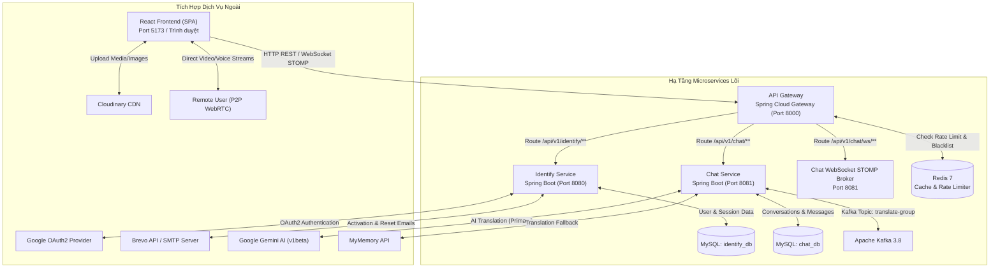
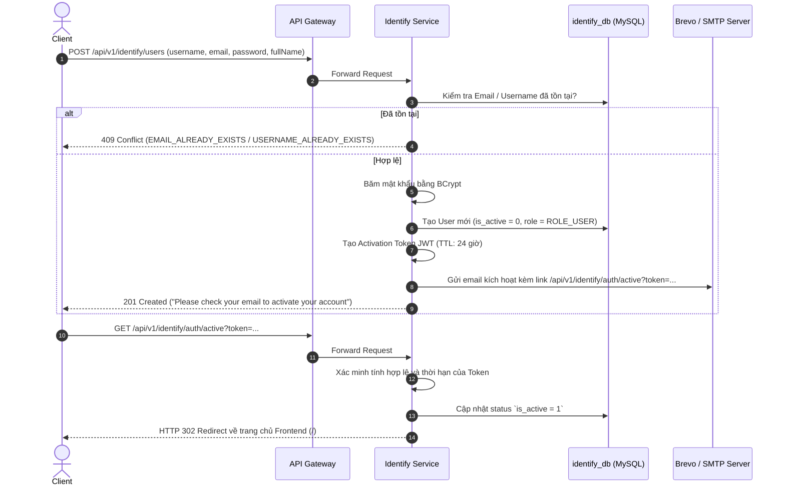
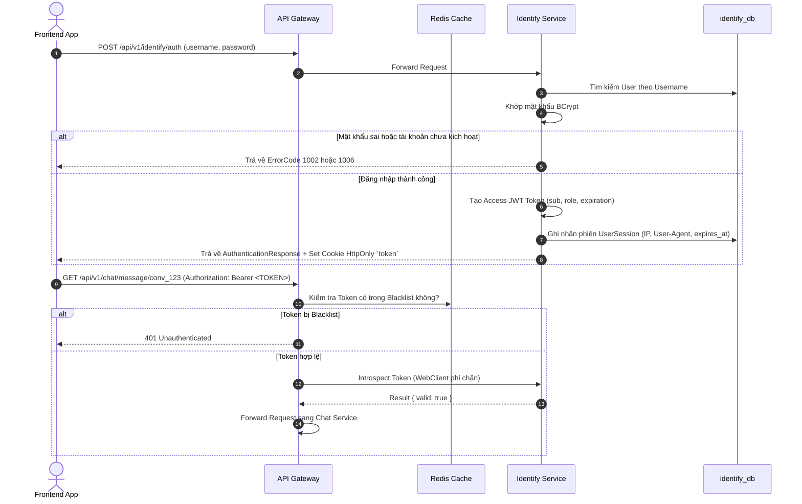
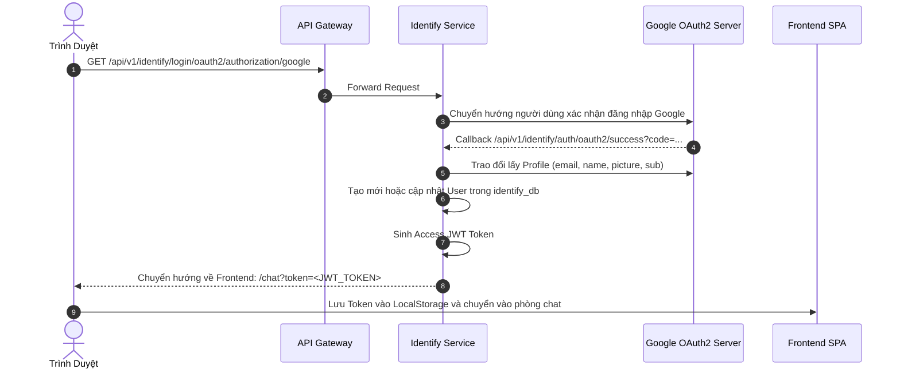
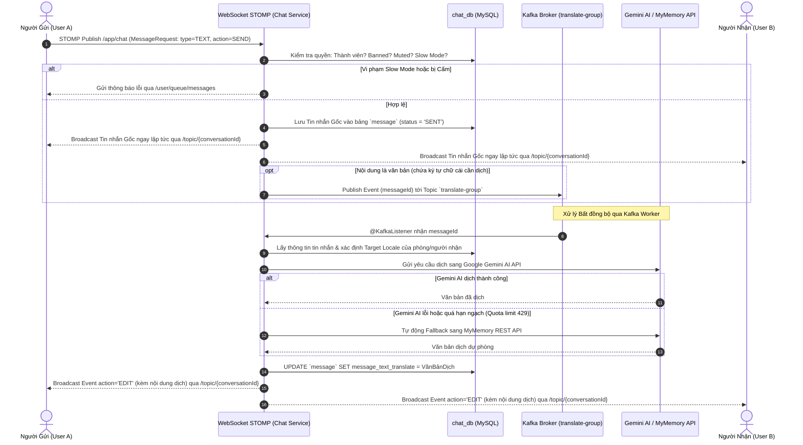
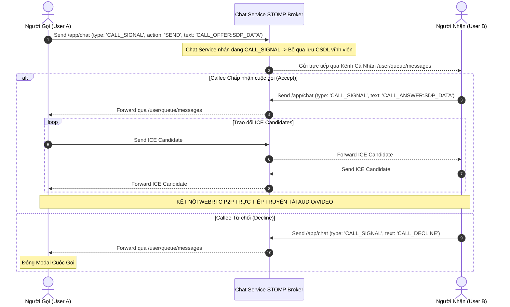
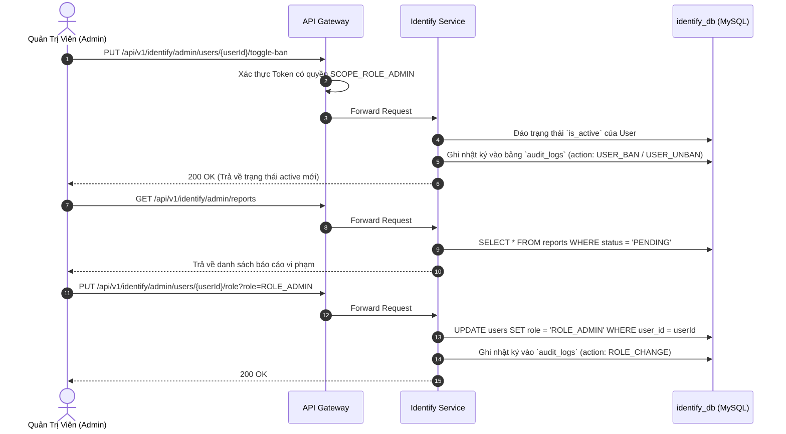
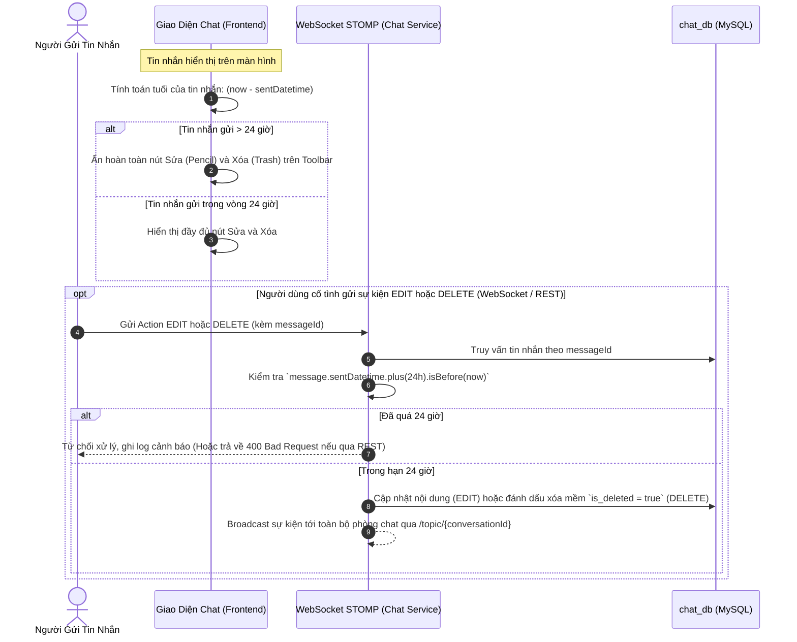

# 🔄 Multilingual Web Chat System Workflows & Sequence Diagrams

> Tài liệu mô tả toàn bộ quy trình nghiệp vụ (Business Workflows), sơ đồ tương tác tuần tự (Sequence Diagrams) và cơ chế vận hành tự động của nền tảng **Multilingual Web Chat**.

---

## 📑 MỤC LỤC
1. [Sơ Đồ Kiến Trúc Tổng Thể](#1-sơ-đồ-kiến-trúc-tổng-thể)
2. [Luồng Đăng Ký & Kích Hoạt Tài Khoản Qua Email](#2-luồng-đăng-ký--kích-hoạt-tài-khoản-qua-email)
3. [Luồng Đăng Nhập Mật Khẩu & Google OAuth2](#3-luồng-đăng-nhập-mật-khẩu--google-oauth2)
4. [Luồng Nhắn Tin Realtime & Dịch Thuật Đa Ngôn Ngữ Bất Đồng Bộ](#4-luồng-nhắn-tin-realtime--dịch-thuật-đa-ngôn-ngữ-bất-đồng-bộ)
5. [Luồng Báo Hiệu Cuộc Gọi Trực Tiếp WebRTC (P2P Audio / Video Call)](#5-luồng-báo-hiệu-cuộc-gọi-trực-tiếp-webrtc-p2p-audio--video-call)
6. [Luồng Điều Phối Nhóm & Kiểm Duyệt Quản Trị (Moderation & Admin Flow)](#6-luồng-điều-phối-nhóm--kiểm-duyệt-quản-trị-moderation--admin-flow)

---

## 1. Sơ Đồ Kiến Trúc Tổng Thể

---

## 2. Luồng Đăng Ký & Kích Hoạt Tài Khoản Qua Email

---

## 3. Luồng Đăng Nhập Mật Khẩu & Google OAuth2

### 3.1 Đăng Nhập Bằng Mật Khẩu (Standard Login)

### 3.2 Đăng Nhập Một Chạm Google OAuth2

---

## 4. Luồng Nhắn Tin Realtime & Dịch Thuật Đa Ngôn Ngữ Bất Đồng Bộ

---

## 5. Luồng Báo Hiệu Cuộc Gọi Trực Tiếp WebRTC (P2P Audio / Video Call)

---

## 6. Luồng Điều Phối Nhóm & Kiểm Duyệt Quản Trị (Moderation & Admin Flow)

---

## 7. Luồng Kiểm Soát Giới Hạn Sửa & Thu Hồi Tin Nhắn (24-Hour Policy Flow)

